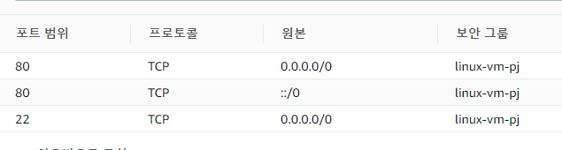
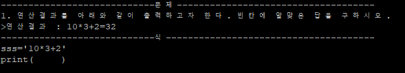
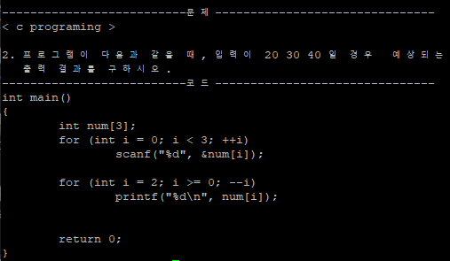

# CloudComputing Project

## 목표 : AWS를 이용하여 우분투 가상머신 생성 후, 코딩테스트 프로그램 구현 
### 1. AWS 인스턴스 생성
#### - http포트 규칙 추가




***
### 2. putty -> SSH연결
#### - 패키지 설치
- gcc

***
### 3. 코딩 문제들을 담을 txt파일 생성
#### - `c.txt`




***
### 4. 코딩 테스트 프로그램 구현
#### - cloud.c
#### `code`
```c
#include <stdio.h>
#include <stdlib.h>
#include <string.h>

int option_mode() {
	int opt;


	printf("=====Select mode=====\n");
	printf("1.easy\n");
	printf("2.normal\n");
	printf("3.hard\n");
	printf("입력 : ");

	scanf("%d", &opt);
	return opt;
}


int option_language() {
	int opt;

	printf("====Select language====\n");
	printf("1. C\n");
	printf("2. Python\n");
	printf("3. Java\n");
	printf("입력 : ");
	scanf("%d",&opt);

	return opt;
}

void read_file(char* file) {
	char buffer[BUFSIZ];
	int size;
	int count;
	

	FILE *fp=fopen(file,"r");
	fseek(fp,0,SEEK_END);
	size=ftell(fp);
	fseek(fp,0,SEEK_SET);
	fread(buffer,size,1,fp);
	printf("%s",buffer);
	fclose(fp);
}


void c() {

	int opt;
        opt=option_mode();
        char file[BUFSIZ];
	switch(opt) {
		case 1:
			//easy file open
			strcpy(file,"c_easy.txt");
			read_file(file);
		break;
		case 2:
			//normal file open
		break;
		case 3:
			//hard file open
		break;

		
	}
      
}

void java() {

	int opt;
        opt=option_mode();

	switch(opt) {
		case 1:
			//easy file open
		break;
		case 2:
			//normal file open
		break;
		case 3:
			//hard file open
		break;
	}
}

void python() {

	int opt;
        opt=option_mode();

	switch(opt) {
		case 1:
			//easy file open
		break;
		case 2:
			//normal file open
		break;
		case 3:
			//hard file open
		break;
	}
}

int main(void) {
	int opt;
	
	opt=option_language();

	switch(opt) {
		case 1:
		c();
		break;

		case 2:
		java();
		break;

		case 3:
		python();
		break;
	}
}

```


